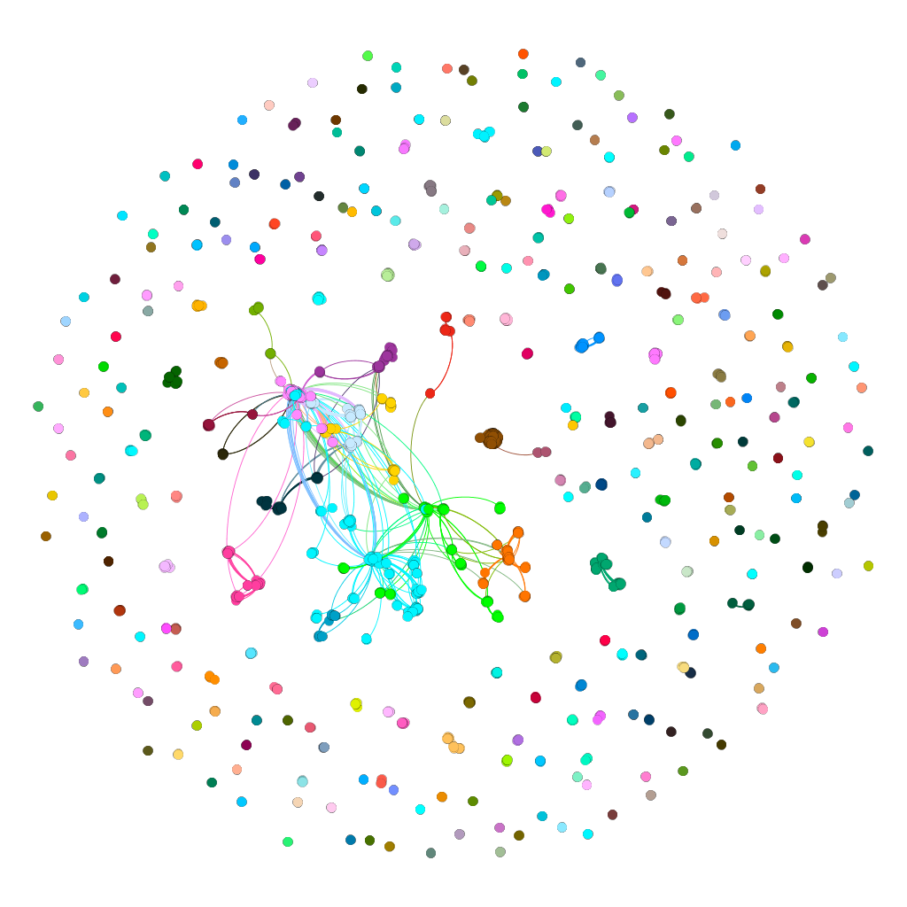

# lod-graph-analysis

Linked Open Data graph analysis 2019 summer intern project.



## File structure

```
.
├── DESCRIPTION: Compendium description for the project. You can install the 
                 packages you'll need to run any .Rmds with this file.
├── LICENSE
├── README.md: This file.
├── analysis: subfolders with specific analyses for specific networks.  
              For example, the ADC_datasets_graph subfolder contains  
              MakeNetwork.Rmd file customized for the ADC datasets graph, along 
              with output files: dataset_attributes (.csv and .Rdata), 
              datasets_graph.Rdata, edge_list.Rdata, 
              gephi_dataset_attributes.csv, gephi_edge_list.csv, 
              network_statistics(.csv and .Rdata).
│   ├── ADC_creators_graph
│   ├── ADC_datasets_graph
│   ├── DataONE_subset_graph
│   └── MakeNetworkGeneric.Rmd: The R Markdown file with the code to make the 
                                network. See notes below.
├── data: .csv files for input into the MakeNetworkGeneric.Rmd file. Structure 
          and content for these files are described in the Rmd.
├── gephi_visualizations: .gephi files that were used to make the visualizations
                          in the final report.
├── lod-graph-analysis.Rproj
└── report
    └── FinalReport190808.pdf
```

## MakeNetworkGeneric.Rmd

This R Markdown document presents code to build a network of datasets from a DataONE member node.  It takes as input a `.csv` file with two columns (a list of users in one column, and a list of datasets in the other), works on the `.csv` table to build a network describing the relationships among datasets in the member node, then calculates statistics of interest for that network. The `.Rmd` file produces two outputs: 

1. A table of networks statistics, saved as a `data.frame` and a `.csv` file.  
2. A `.csv` file with three node characteristics: 
    - Node degree
    - Node modularity class for two different community detection algorithms 

Details about how to run the code are included in the `.Rmd` file.  The `MakeNetworkGeneric.Rmd` file will run as-is, but the analyst will probably want to customize it for the particular network being built.
